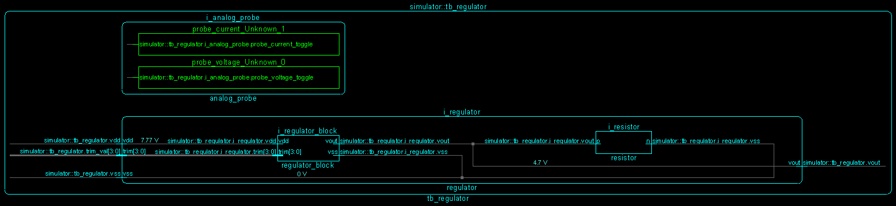
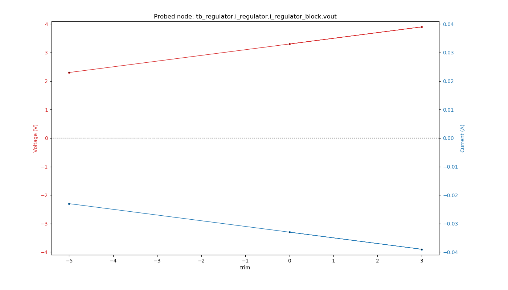

##################################
The cocotb ``regulator`` Testbench
##################################

.. versionadded:: 1.3

This is the testbench :mod:`test_regulator` for the design ``regulator`` showing
how cocotb can be used in an analog-mixed signal (AMS) simulation.

******************
Overview Schematic
******************

**********
The Design
**********

The design ``i_regulator`` consists of a trimmable regulator model written in Verilog-AMS (instance name ``i_regulator_block``),
and load resistor (instance name ``i_resistor``).

.. literalinclude:: ../../examples/mixed_signal/hdl/regulator.sv
   :caption: regulator.sv
   :language: systemverilog

.. literalinclude:: ../../examples/mixed_signal/hdl/regulator_block.vams
   :caption: regulator_block.vams
   :language: systemverilog

*************
The Testbench
*************
 
The testbench consists of both an HDL part and a Python/cocotb part.

The HDL part of the Testbench
=============================

The testbench HDL part is written in SystemVerilog and instantiates the design described above as ``i_regulator``.
It also contains a probe module for analog values as instance ``i_analog_probe`` —
imagine this being a multimeter that you quickly connect to different nodes in the design, measuring either voltage or current.

.. literalinclude:: ../../examples/mixed_signal/hdl/tb_rescap.sv
   :caption: tb_rescap.sv
   :language: systemverilog

The probe module can capture voltage and current of a node specified by ``node_to_probe`` (a string in this module containing a hierarchical path).
The capturing occurs whenever there is an edge on the logic signals ``probe_voltage_toggle`` or ``probe_current_toggle``.
The captured values can be read on real-value signals ``voltage`` and ``current`` in this module.

Here is the capture code for ``voltage`` with the "user-interface" highlighted:

.. literalinclude:: ../../examples/mixed_signal/hdl/analog_probe_cadence.sv
   :caption: analog_probe_cadence.sv
   :language: systemverilog
   :lines: 3-15
   :emphasize-lines: 1-4
   :dedent: 2

.. note:: This analog probe module is currently only implemented for the Cadence Incisive and Xcelium simulators.
            
The cocotb part of the Testbench
================================

``test_regulator_minimalist``
-----------------------------

This is a fairly minimalistic testcase.
To run it, do:

.. code-block:: bash

    make SIM=xcelium TOPLEVEL=tb_regulator MODULE=test_regulator_minimalist

The testcase supplies the circuit with ``vdd`` and calls the trimming routine :meth:`~test_regulator.Regulator_TB.find_trim_val()`
to find the best trim value for a given target output voltage ``vout`` of the regulator.
The found trim value and the resulting regulator output voltage (which will not exactly hit the target value) are printed.

``test_regulator``
------------------

This is a more advanced testcase.
To run it, do:

.. code-block:: bash

    make SIM=xcelium TOPLEVEL=tb_regulator MODULE=test_regulator

The testcase first sets a ``vdd`` voltage and three different trim values, saving the resulting output voltage ``vout`` for each.
The saved data is printed as a graph (see below).

It then runs an automatic trimming routine :meth:`~test_regulator.Regulator_TB.find_trim_val()` to find the best trim value for a given target voltage.
The found trim value and the resulting regulator output voltage (which will not exactly hit the target value) are printed.

***********************
Reference Documentation
***********************

cocotb Testbench
================

.. currentmodule:: test_regulator

.. autoclass:: Regulator_TB

    .. automethod:: get_sample_data(nodes, num, delay_ns)
    .. automethod:: find_trim_val(probed_node, target_volt, trim_val_node, trim_val_signed, trim_val_min, trim_val_max)
    .. automethod:: plot_data(datasets, graphfile)

.. autoclass:: Dataset
    :show-inheritance:
    :members:
    :member-order: bysource
