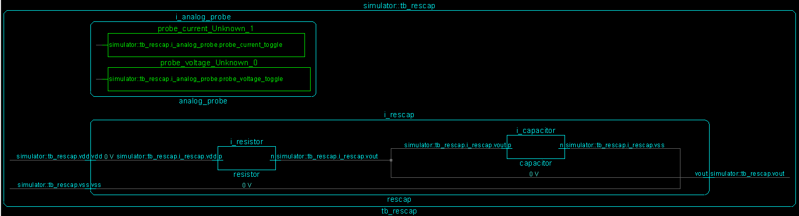

*******************************
The cocotb ``rescap`` Testbench
*******************************

.. versionadded:: 1.3

This is the testbench :mod:`test_rescap` for the design ``rescap`` showing
how cocotb can be used in an analog-mixed signal (AMS) simulation.

Overview Schematic
==================

The Design
==========

The design consists of a resistor and capacitor model (both written in Verilog-AMS) connected in series in a SystemVerilog module, as shown here:

.. code-block:: none

          i_resistor             i_capacitor
  vdd >---o--v^v^v--o------------o---||---o---< vss
          p         n    vout    p        n

The code of the design is:

.. literalinclude:: ../../examples/mixed_signal/hdl/rescap.sv
   :caption: rescap.sv
   :language: systemverilog

The Testbench
=============
 
The testbench consists of both an HDL part and a Python/cocotb part.

The HDL part of the Testbench
-----------------------------

The testbench HDL part is written in SystemVerilog and instantiates the design described above as ``i_rescap``.
It also contains a probe module for analog values as instance ``i_analog_probe`` —
imagine this being a multimeter that you quickly connect to different nodes in the design, measuring either voltage or current.

.. literalinclude:: ../../examples/mixed_signal/hdl/tb_rescap.sv
   :caption: tb_rescap.sv
   :language: systemverilog

The probe module can capture voltage and current of a node specified by ``node_to_probe`` (a string in this module containing a hierarchical path).
The capturing occurs whenever there is an edge on the logic signals ``probe_voltage_toggle`` or ``probe_current_toggle``.
The captured values can be read on real-value signals ``voltage`` and ``current`` in this module.

Here is the capture code for ``voltage`` with the "user-interface" highlighted:

.. literalinclude:: ../../examples/mixed_signal/hdl/analog_probe_cadence.sv
   :caption: analog_probe_cadence.sv
   :language: systemverilog
   :lines: 3-15
   :emphasize-lines: 1-4
   :dedent: 2

.. note:: This analog probe module is currently only implemented for the Cadence Incisive and Xcelium simulators.
            
The cocotb part of the Testbench
--------------------------------

``test_rescap_minimalist``
^^^^^^^^^^^^^^^^^^^^^^^^^^

This is a very minimalistic testcase.
To run it, do:

.. code-block:: bash

    $> make SIM=xcelium TOPLEVEL=tb_rescap MODULE=test_rescap_minimalist

The testcase supplies ``vdd`` and measures three pairs of voltage and current at the ``p`` terminal of the capacitor,
spaced 50 ns apart.

``test_rescap``
^^^^^^^^^^^^^^^

This is a more advanced testcase.
To run it, do:

.. code-block:: bash

    $> make SIM=xcelium TOPLEVEL=tb_rescap MODULE=test_rescap

The cocotb part of the testbench provides functions to:

* do the sampling of voltage and current of a given node (:meth:`~test_rescap.ResCap_TB.get_sample_data()`),
* plot the sampled data to a file (:meth:`~test_rescap.ResCap_TB.plot_data()`).

The testcase supplies first a positive voltage to the circuit at ``vdd``, followed by a negative voltage,
thus charging the capacitor in opposite directions.
The following graph shows the charge curve.
The sampled voltages and currents continually switch between the node where the supply is (``tb_rescap.i_rescap.vdd``),
and the output voltage ``tb_rescap.i_rescap.vout``.
There is no current flowing out of this output voltage terminal, so this current measurement is always zero.

.. image:: rescap.png

Reference Documentation
=======================

cocotb Testbench
----------------

.. currentmodule:: test_rescap

.. autoclass:: ResCap_TB

    .. automethod:: get_sample_data(nodes, num, delay_ns)
    .. automethod:: plot_data(datasets, graphfile)

.. autoclass:: Dataset
    :show-inheritance:
    :members:
    :member-order: bysource
