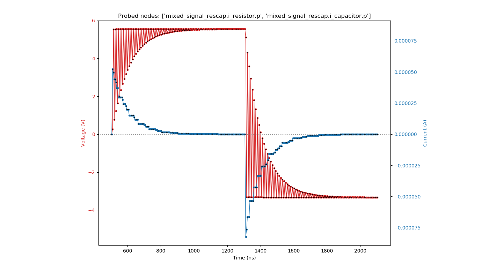

The cocotb ``rescap`` Testbench
============================================

This is a `cocotb <https://cocotb.readthedocs.io>`_ testbench :mod:`test_rescap`
for the design ``rescap``.

The design consists of a resistor and capacitor model (both written in Verilog-AMS) connected in series, as shown here:

.. code-block:: none

          i_resistor             i_capacitor
  vdd >---o--v^v^v--o------------o---||---o---< vss
          p         n    vout    p        n

It is written in SystemVerilog and has the instance name ``i_rescap``.

.. literalinclude:: ../../examples/mixed_signal/hdl/rescap.sv
   :caption: rescap.sv
   :language: systemverilog
   :dedent: 2

The testbench consists of both an HDL part and a Python/cocotb part.

The HDL part contains a probe module for analog values (instance name ``i_analog_probe``) which can capture
the voltage and current of a node specified by ``node_to_probe`` (a string containing a hierarchical path).
The capturing occurs whenever there is an edge on the logic signals ``probe_voltage_toggle`` or ``probe_current_toggle``.
The captured values can be read on real-value signals ``voltage`` and ``current`` in this module.

Here is the capture code for ``voltage`` with the "user-interface" highlighted:

.. literalinclude:: ../../examples/mixed_signal/hdl/analog_probe_cadence.sv
   :caption: analog_probe_cadence.sv
   :language: systemverilog
   :lines: 3-15
   :emphasize-lines: 1-4
   :dedent: 2

The cocotb part of the testbench provides functions to:

* do the sampling of voltage and current of a given node (:meth:`~test_rescap.ResCap_TB.get_sample_data()`),
* plot the sampled data to a file (:meth:`~test_rescap.ResCap_TB.plot_data()`).

The following image shows the charge curve of the circuit.
The sampled voltages and currents continually switch between the node where the supply is (``i_resistor.p``),
and the positive terminal of the capacitor (``i_capacitor.p``).
Thus, the voltage shows this envelope while the current is the same at both nodes.

Reference Documentation
-----------------------

cocotb Testbench
~~~~~~~~~~~~~~~~

.. currentmodule:: test_rescap

.. autoclass:: ResCap_TB

    .. automethod:: get_sample_data(nodes, num=1, delay_ns=1)
    .. automethod:: plot_data(datasets, graphfile="cocotb_plot.png")

.. autoclass:: Dataset
    :show-inheritance:
    :members:
    :member-order: bysource

Indices and tables
------------------

* :ref:`genindex`
* :ref:`modindex`
* :ref:`search`
